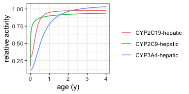

<!-- README.md is generated from README.Rmd. Please edit that file -->

# ontogenr

<!-- badges: start -->
<!-- badges: end -->

ontogenr provides functions to calculate the relative activity of drug
metabolizing enzymes and drug transporter proteins for a given age.

## Installation

You can install the development version of ontogenr like so:

``` r
devtools::install_github("rstrotmann/ontogenr")
```

## Example

Plot ontogenetic profiles for some CYP enzymes:

``` r
library(tidyverse)
library(ontogenr)

ontogeny_plot(c("CYP3A4", "CYP2C9", "CYP2C19"))
```


